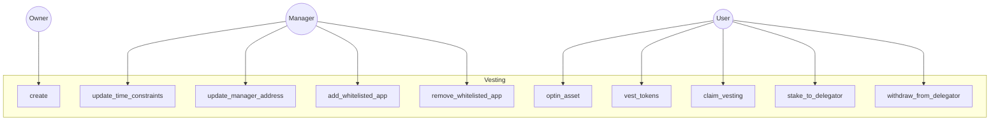
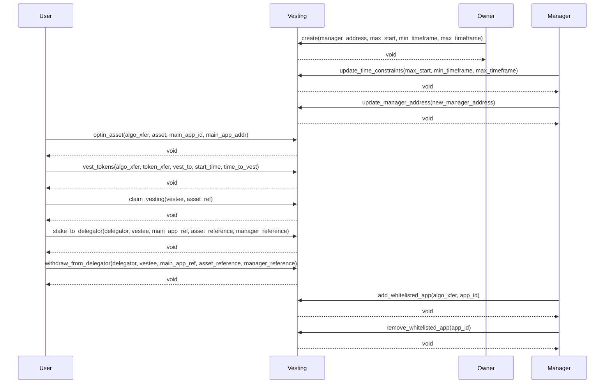
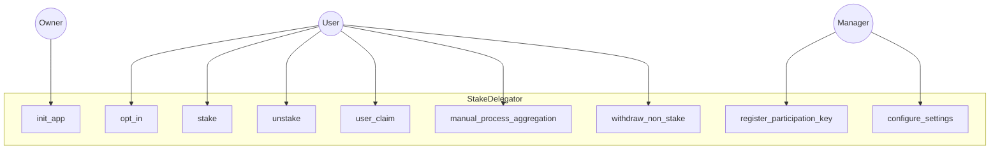
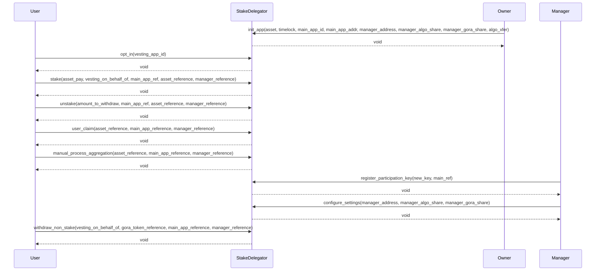

## Gora Existing Contracts: V2

### Gora Vesting Contracts: V2
The Vesting contract in GoraNetwork is designed to manage the vesting schedules of tokens for users. It allows the creation of vesting parameters, including setting up a manager's address and defining time constraints for vesting. Users can opt into assets, vest tokens according to a specified schedule, and claim vested tokens when the time is right. The contract also integrates with the StakeDelegator, enabling users to stake their vested tokens to the delegator or withdraw them. Managers have the authority to update time constraints, change the manager's address, and manage a whitelist of apps that can interact with the vesting system. This contract ensures that tokens are vested and claimed in a secure and time-bound manner, reinforcing trust and transparency in the GoraNetwork's token distribution process.

These passages provide a high-level overview of the roles of the StakeDelegator and Vesting contracts in the GoraNetwork system. The exact functionalities and intricacies would be better understood by diving deeper into the contract code and the broader GoraNetwork architecture.

### Gora Stake delegation Contracts: V2

The StakeDelegator contract serves as a central hub for staking operations in the GoraNetwork. It facilitates the initialization of a stake delegation manager app on-chain with parameters like the Gora main app's ID, address, and stake delegation manager's address. Users can opt into the system, stake their assets, and unstake them when needed. The contract also provides functionalities for users to claim their stakes, manually process aggregations, and register participation keys. Managers have the flexibility to configure settings, such as updating their address and defining their share percentages. Additionally, the contract ensures secure transfers of Algos and assets, making it a pivotal component in the staking ecosystem of GoraNetwork.

