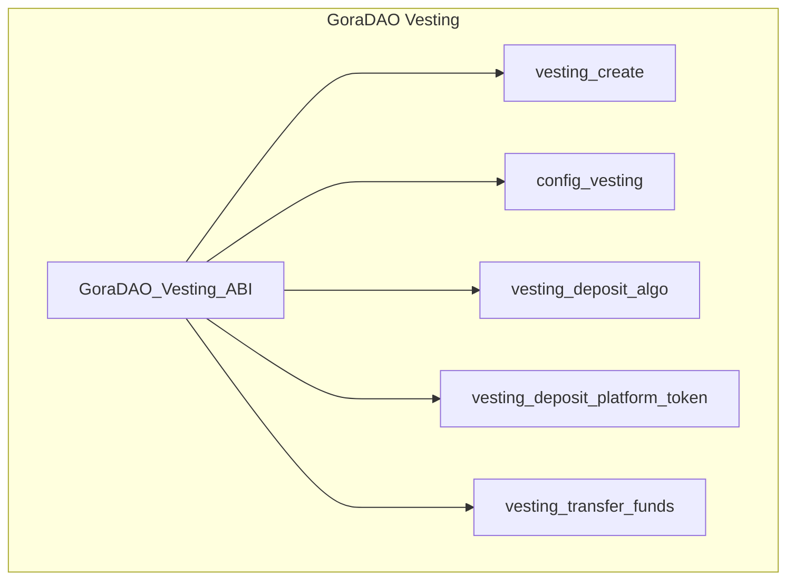

### Gora DAO Vesting Contract: V1

GoraDAO Vesting contracts are bound to Proposals and will be activated by the first successful vote approval which passes the active proposal threshold! 

The vesting algorithm is provided by Configure_Vesting method, during which the vesting configuration is sent via args plus necessary related data such as proper Lease values as needed! There are two major vesting algorithm parameters:

- Initial vesting delay (no matter what this much round or time further vesting starts)
- Based on vesting config including how many payments and time window between vestings!
- After voting starts on Proposal contract there is no configurations allowed

TODO: Vesting algorithm ...

QUESTION: Is this a good approach to have vesting contract per approved proposal which intends to maximize decentralization or it is better to make it less decentralized and use Gora Vesting contract and stake delegation ABIs via C2C calls from Proposal contracts? Regardless , the focus is on GoraDAO Proposals contracts lifecycle and Voting operations!

IDEA: A time beacon oracle for apps to subscribe to and receive push chain time scheduled or GoraDAO events based announcements (this can be extended into VRF random beacon and app ABI call beacon oracles as to be added to GoraNetworks oracle catalogues)!

IDEA: the above idea can be generalized with an ARC for a general oracle beacon service from GoraNetwork! This does not need any consensus or voting and just using a predictable lease with all beacon sources!
  

