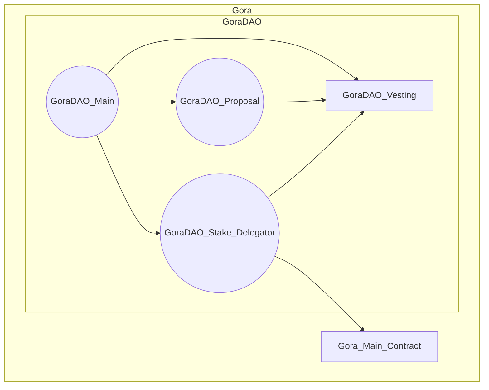
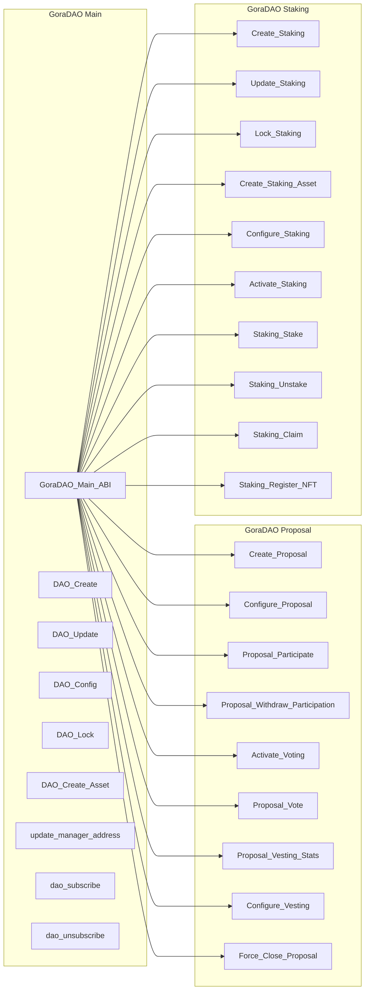
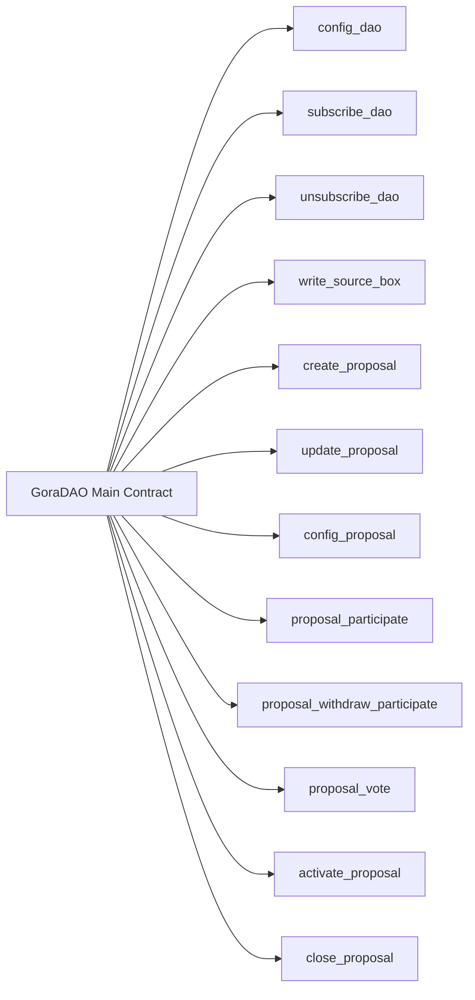
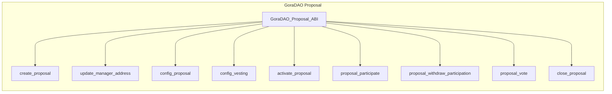
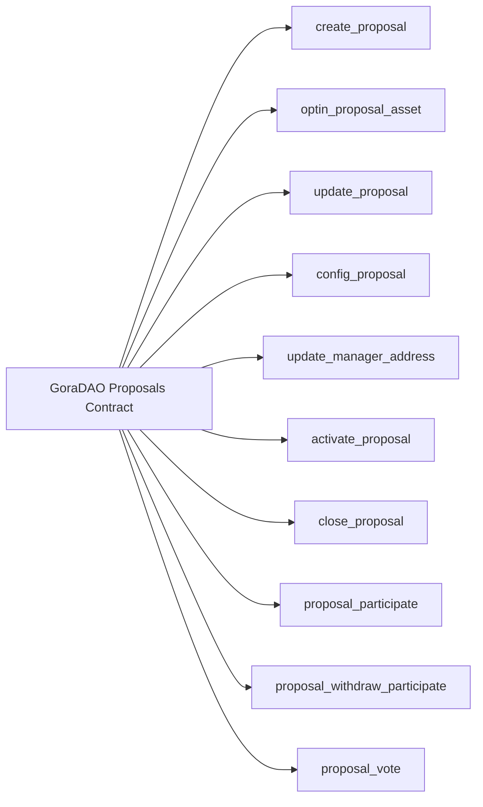
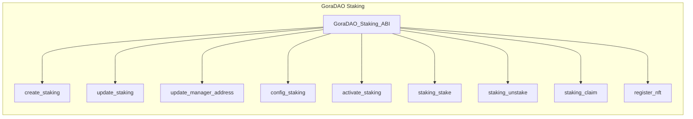
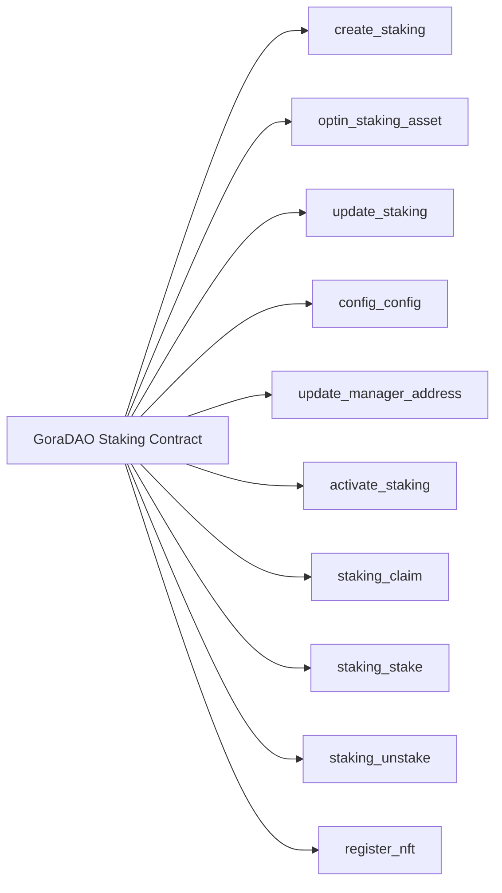

# GoraDAO
### A new non-opinionated, dynamic approach to DAO


    .d8888b.                           8888888b.        d8888  .d88888b.  
    d88P  Y88b                          888  "Y88b      d88888 d88P" "Y88b 
    888    888                          888    888     d88P888 888     888 
    888         .d88b.  888d888 8888b.  888    888    d88P 888 888     888 
    888  88888 d88""88b 888P"      "88b 888    888   d88P  888 888     888 
    888    888 888  888 888    .d888888 888    888  d88P   888 888     888 
    Y88b  d88P Y88..88P 888    888  888 888  .d88P d8888888888 Y88b. .d88P 
     "Y8888P88  "Y88P"  888    "Y888888 8888888P" d88P     888  "Y88888P"  


|  <br>GoraDAO is developed, maintained, and implemented as GoraDAO service by [Gora](https://gora.io)!| |  
| -------- | ------- | 

This repository is a work in progress and contains Algorand TEAL smart contracts of GoraDAO, plus interactive CLI to test and operate it!

GoraDAO provides dynamic generation of Staking, NFT-Staking, Proposals and Vesting (optional for future development phase ) contracts via C2C calls and offers unique DAO features:

- Self-contained, decentralized, and permission-less lifecycle
- Interactive CLI
- Web interface provided by GoraNetwork as well
- 100% Sybil resistant
- 100% double-vote resistant (as per identity level on Algorand blockchain)
- Configurable Subscription to DAO and Participation to Proposals
- Configurable Voting
- Configurable Algo and BYOT for staking and fees
- Configurable NFT-Staking
- Full separation of concerns on staking and fees limits for proposals and voting to maintain 100% decentralization and permissionless system.
- Update and Delete can be disabled on Proposals, Staking and Vesting contracts (After development and community feedback)
- Configurable Vesting (future phase)
- Configurable Staking (Direct and delegated staking V3 contracts under one DAO)

A note on DAO processes:

- GoraDAO Proposal Proposers processes
  - Meet requirements (Minimum subscription fees in Algo and/or DAO Token)
  - Subscribe to DAO
  - Propose proposals
- GoraDAO Proposal Participants processes
  - Meet requirements (Minimum participation stakings and fees in Algo and/or DAO Token)
  - Participate in proposal (it's like registration for voting)
  - Cast vote
- GoraDAO managers processes:
  - Deploy DAO
  - Configure DAO
  - Distribute DAO token
- GoraDAO Staking managers processes:
  - Create Staking
  - Optionally create Staking Asset (OR enforce Gora token as staking asset)
  - Configure Staking
  - Activate Staking
  - Stake (direct staking or NFT staking)
  - Unstake
  - Claim
  - Distribute DAO token (Optional)

A note on threshold parameters structure:
Each proposal's behavior regarding activation for voting, the conclusion of voting, and such is controlled through some parameters during the proposal configuration ABI call:

- participation threshold: an array (tuple) of Uint64 integer numbers of expected participation count (e.g how many would participate in voting)
- vote threshold: an array (tuple) of Uint64 integer numbers, the same size as the participation threshold ( extra values will be ignored by smart contract), including voting thresholds for peer index of participation threshold (for example: if 250 participants then 150 votes are needed for the proposal to pass). 
- proposal allocations: an array (tuple) of Uint64 integer numbers, the same size as the participation threshold ( extra values will be ignored by smart contract), including allocation amounts for peer index of participation threshold (example: if 250 participants then 150 votes are needed for the proposal to pass and all 1000000 requested token are approved to be allocated for vesting)

Example: `
[250,150, 100]
[150,85, 50]
[1000000,750000, 500000]
`

Important note: On UI level these numbers should be asked from the user as percentages and there (based on the total amount) software should calculate the rounded integer numbers for each index on each parameter and then make the ABI call.

With this innovative approach, DAO proposals get more dynamic and proactive in the face of different participation behaviors from the community!

## Gora DAO Contracts: V1

GoraDAO contracts follow these principal designs:
- No static or hard-coded value
- All scenarios are created based on ABI calls to GoraDAO contracts
- There is one Proposal and one Vesting contract(future work) per Proposal to make the GoraDAO as decentralized and permission-less as possible!
- ABIs 100% compliant with ARC4
- No Update or Delete for Proposals after Locking
- No app opt-in or local state usage anywhere

As illustrated in the following diagram GoraDAO on-chain architecture is focused on integration and interoperability with existing working Gora smart contracts!

**Gora & GoraDAO on-chain architecture:**


### Gora DAO Main Contract: V1

GoraDAO main contract, once deployed to a network, will be responsible for generating Staking, Proposals and Vesting Contracts(future work).
GoraNetwork deploys the GoraDAO main contract and owns managerial rights to it and optionally can assign a manager address to delegate the authority to another Algorand account address (probably a multisig for DAO governance).

Proposal contract create and configure ABI calls would create Proposal units (if all criteria is met by the call ARGs) and after that the Proposal creator account would be the manager of that Proposal unit and inherently can assign and delegate this to another account!
The scope of authority Proposal manager account has is not broad and is only to maintain 100% non-custodial, decentralized and permission-less DAO protocol, nothing more! For example, Proposal manager cannot delete proposal and just can deactivate it and withdraw from it! Delete and update are disabled on Proposals as well as their peer vesting contracts (future work)!


Future implementation idea: Add configuration to GoraDAO in a way that it should only come from a child proposal to be approved sothat there can be Proposals in the future to tune GoraDAO further more or change the settings on that! E.g. the required Gora amount to create a Proposal!


### GoraDAO Main Contract Methods

- config_dao: Initializes DAO! Should be sent by owner (Creator) of DAO! Returns the manager address!
- subscribe_dao: Subscribes an Algorand account into GoraDAO! Returns total number of members!
- unsubscribe_dao: Unsubscribes an Algorand account from GoraDAO! Returns total number of members!
- write_source_box: Writes the compiled teal source of proposal to a corresponding box - proposal_approval or proposal_clear.
- create_proposal: Creates a new Proposal contract! Returns the Proposal contract ID!
- update_proposal: Updates a Proposal smart contract and returns application ID.
- config_proposal: Configures a Proposal contract! Returns the Proposal contract ID!
- proposal_participate: Participates a member to a Proposal! Returns the Proposal contract ID!
- proposal_withdraw_participate: Withdraws a member participation from a Proposal! Returns the Proposal contract ID!
- proposal_vote: Optionally Votes to a Proposal! Returns the Proposal contract ID!
activate_proposal: Activates a Proposal! Returns the Proposal contract ID!
- close_proposal: Force closes a Proposal contract as last resort. Returns the Proposal contract ID!


## GoraDAO CLI
GoraDAO CLI is a powerful conversational CLI that provides easy implementation, deployment, and management of GoraDAO as an independent DAO. This feature is both useful for domestic development and product lifecycle for GoraNetworks implementation of GoraDAO and also for after open sourcing GoraDAO to be used by anyone to implement a DAO, leading to more adoption of technology.
### CLI First Look


### Dispense your accounts
Upon first run , neccessary Algorand account menmonics are created and writen under local copy ofn repository on user file system to be used in future with CLI. Feel free to change any of those before dispensing to it.
Created accounts include:
- Menmonic0: GoraDAO Admin user
- Menmonic1: GoraDAO proposals admin
- Menmonic2: GoraDAO user1
- Menmonic3: GoraDAO user2
- Menmonic4: GoraDAO user3
- Menmonic5: GoraDAO user4
- Menmonic6: GoraDAO user5
- Menmonic7: GoraDAO Staking Admin
  
And then admin user dispenses into GoraDAO Menmonics:


## GoraDAO MAIN Operations CLI Screen cast 


### Gora DAO Proposal Contract: V1
GoraDAO Proposal contracts are created from an ABI call to main contract and constitute an inner transaction C2C call to create Proposal contract!

The phases of a proposal lifecycle are:

- Creation
- Configuration
- Update (Before Lock)
- Participation
- Voting activation (Locks)
- Voting
- Closure
- Force Closure


Important note: Force_Close_Proposal is a multi step process , only designed for extreme emergency cases where something is agreed by almost everyone to go wrong and therefore grants from owner, manager_address and also Gora main contract manager are needed to be effective and close the Proposal and archive it! There are no limitations on creating a new Proposal with identical specifications though!

The activate_proposal is a manual override in case of min_participation is not met! The voting activation handled in GoraDAO:
- Time based activation in case that min-participation is met!
- Min participation is met before start time---> activate_proposal can activate (This does not change the voting ending conditions including end_time and all_voted).

Note : Because the vesting(future work) is still an open topic in GoraNetwork, Configure_Vesting method is not detailed in ABI or developed in TEAL code yet!

Some methods have constraint of being in same transaction group as a call to identical method name with different signature to either GoraDAO main or vesting contracts! These methods are:

- Configure_Proposal
- Configure_Vesting
- Proposal_Participate
- Activate_Voting
- Proposal_Withdraw_Participation
- Force_Close_Proposal



### GoraDAO Proposals Contract Methods
- create_proposal: Creates a new Proposal contract! Returns the Proposal contract ID!
- optin_proposal_asset: Signal to optin to proposal asset.
- update_proposal: Updates an existing Proposal contract! Returns the Proposal contract ID!
- config_proposal: Configures a Proposal contract! Returns the Proposal contract ID!
- update_manager_address: Updates Proposal manager address! Returns new manager address.
- activate_proposal: Activates a Proposal voting! Returns the Proposal contract ID!
- close_proposal: Force closes a Proposal contract as a last resort. Returns the Proposal contract ID!
- proposal_participate: Participates with a member account into a Proposal! Returns the participating member's account address!
- proposal_withdraw_participate: Withdraws participation of a member account from a Proposal! Returns the withdrawing member's account address!
- proposal_vote: Votes for a Proposal! Returns the voting member's account address concatenated with vote!




## GoraDAO Proposals & Voting Operations CLI Screen cast 


### Gora DAO Staking Contract: V3
GoraDAO Staking contracts are created from an ABI call to DAO main contract and constitute an inner transaction C2C call to create Staking contract. Config, Activate, Stake, Unstake, Claim, Register NFT are called concurrently with the same method name to GoraDAO main contract and staking V3 contracts!

There are types to staking contracts in GoraDAO:
- Delegated Staking
- NFT Staking

The phases of a staking lifecycle are:

- Creation
- Configuration
- Update (before Lock)
- Activate/Lock
- Stake
- Unstake
- Claim


Note : Because the vesting(future work) is still an open topic in GoraNetwork, Configure_Vesting method is not detailed in ABI or developed in TEAL code yet!

Some methods have constraint of being in same transaction group as a call to identical method name with different signature to either GoraDAO main or vesting contracts(future work)! These methods are:

- Create_Staking (Delegated Staking creation method called to MAIN and STAKING V3 contracts in one atomic group)
- Update_Staking (Delegated Staking update method called to MAIN and STAKING V3 contracts in one atomic group)
- Configure_Staking (Delegated Staking config method called to MAIN and STAKING V3 contracts in one atomic group)
- Activate_Staking (Delegated Staking activation method called to MAIN and STAKING V3 contracts in one atomic group)
- Staking_Stake (Delegated Staking stake method called to MAIN and STAKING V3 contracts in one atomic group)
- Staking_Unstake (Delegated Staking unstake method called to MAIN and STAKING V3 contracts in one atomic group)



### GoraDAO Staking Contract Methods

- create_staking: Creates a new Staking contract! Returns the Staking contract ID!
  - DAO ABI call:
  ```javascript
  {
            "name": "create_staking",
            "description": "Creates a new Staking contract! Returns the Staking contract ID!",
            "args": [
                {
                    "type": "pay",
                    "name": "payment_transaction",
                    "description": "Payment from Proposer to DAO for Staking fees and initiation MBRs!"
                },
                {
                    "type": "uint64",
                    "name": "asset_reference",
                    "description": "DAO Staking token ref"
                },
                {
                    "type": "uint64",
                    "name": "asset_reference",
                    "description": "DAO token ref"
                },
                {
                    "type": "string",
                    "name": "staking_name",
                    "description": "DAO Staking title"
                },
                {
                    "type": "string",
                    "name": "staking_description",
                    "description": "DAO Staking description"
                }
            ],
            "returns": {
                "type": "uint64"
            }
        },
  ```
  - Staking ABI call:
  ```javascript
   {
            "name": "create_staking",
            "description": "Creates a new Staking contract! Returns the Staking contract ID!",
            "args": [
                {
                    "type": "uint64",
                    "name": "dao_asset_reference",
                    "description": "DAO Main asset (DAO) ID"
                },
                {
                    "type": "uint64",
                    "name": "staking_asset_reference",
                    "description": "Staking asset ID"
                },
                {
                    "type": "string",
                    "name": "staking_name",
                    "description": "Staking title"
                },
                {
                    "type": "string",
                    "name": "staking_description",
                    "description": "Staking description"
                }
            ],
            "returns": {
                "type": "address"
            }
        },
  ```
- update_staking: Updates a new Staking contract (Before it's Locked)! Returns the Staking contract ID!
  - DAO ABI Call
  ```javascript
   {
            "name": "update_staking",
            "args": [
                {
                    "type": "pay",
                    "name": "payment_transaction",
                    "description": "Payment from Staking to DAO for Proposal fees and initiation MBRs!"
                },
                {
                    "type": "application",
                    "name": "staking_app_ref",
                    "description": "Staking application  to be referenced"
                },
                {
                    "type": "uint64",
                    "name": "staking_app_id",
                    "description": "Staking application  ID to be updated"
                },
                {
                    "type": "address",
                    "name": "member_reference",
                    "description": "DAO member account reference (Staking manager)"
                },
                {
                    "type": "uint64",
                    "name": "asset_reference",
                    "description": "DAO Staking token ID"
                }
            ],
            "returns": {
                "type": "uint64"
            },
            "desc": "Updates a Staking smart contract and returns application ID"
        }

  ```
  - Staking ABI Call
  ```javascript
   {
            "name": "update_staking",
            "description": "Updates an existing Staking contract! Returns the Staking contract ID!",
            "args": [],
            "returns": {
                "type": "address"
            }
        },

  ```
- config_staking: Configures a Staking contract! Returns the Staking contract ID!
  - DAO ABI Call
  ```javascript
    {
            "name": "config_staking",
            "description": "Configures a Staking contract! Returns the Staking contract ID!",
            "args": [
                {
                    "type": "pay",
                    "name": "payment_transaction",
                    "description": "Payment from Staking to DAO for fees and Staking MBRs!"
                },
                {
                    "type": "axfer",
                    "name": "dao_asset_transfer_transaction",
                    "description": "Asset transfer transaction to deposit DAO token (E.g. Gora)!"
                }
            ],
            "returns": {
                "type": "uint64"
            }
        },
  

  ```
  - Staking ABI Call
  ```javascript
  {
            "name": "config_staking",
            "description": "Configures a Staking contract! Returns the Staking contract ID!",
            "args": [
                {
                    "type": "pay",
                    "name": "payment_transaction",
                    "description": "Payment from Staking manager to DAO for fees and Staking configuration MBRs!"
                },
                {
                    "type": "(uint64,uint64,uint64,uint64,uint64,uint64,uint64,uint64,uint64,uint64,uint64,uint64,uint64,uint64,uint64)",
                    "name": "config_params",
                    "description": "min_algo, min_token, duration, min_duration, commission_token, commission_algo, fee_token, fee_algo, incentives_token,incentives_algo,type, incentives_duration, return_token, return_algo,incentives_eligibility"
                },
                {
                    "type": "string",
                    "name": "name",
                    "description": "DAO Staking name"
                },
                {
                    "type": "string",
                    "name": "description",
                    "description": "DAO Staking description"
                },
                {
                    "type": "string",
                    "name": "url",
                    "description": "DAO Staking URL"
                },
                {
                    "type": "string",
                    "name": "banner",
                    "description": "DAO Staking banner image URL"
                },
                {
                    "type": "uint64",
                    "name": "v2_main_app_id",
                    "description": "V2 main app ID"
                },
                {
                    "type": "uint64",
                    "name": "v2_vesting_app_id",
                    "description": "V2 vesting app ID"
                }
            ],
            "returns": {
                "type": "uint64"
            }
        },

  ```

- register_nft: Registers an NFT to a Staking contract! Returns the NFT ID!
  - Staking ABI Call
  ```javascript
  {
            "name": "register_nft",
            "description": "Register staking NFT!",
            "args": [
                {
                    "type": "uint64",
                    "name": "staking_nft",
                    "description": "The staking NFT asset"
                },
                {
                    "type": "uint64",
                    "name": "staking_nft_value",
                    "description": "The Staking token value of the staking NFT "
                }
            ],
            "boxes": [
                {
                    "name": "manager_reference",
                    "description": "Dynamic box ref per member account address"
                },
                {
                    "name": "staking_account",
                    "description": "Dynamic box per staking account (as key) and staking amount (as value)"
                }
            ],
            "returns": {
                "type": "uint64"
            }
        },

  ```
- activate_staking: Activates a Staking contract, open for staking! Returns the Staking contract ID!
  - DAO ABI Call
  ```javascript
  {
            "name": "activate_staking",
            "description": "Activates staking contract!",
            "args": [],
            "returns": {
                "type": "uint64"
            }
        },

  ```
  - Staking ABI Call
  ```javascript
    {
            "name": "activate_staking",
            "description": "Activates a Staking! Returns the Staking contract ID!",
            "args": [],
            "returns": {
                "type": "uint64"
            }
        }

  ```
- staking_stake: Delegates a user account to staking! Returns the staking member's account address!
  - DAO ABI Call
  ```javascript
     {
            "name": "stake",
            "description": "Stake into staking contract!",
            "args": [
                {
                    "type": "pay",
                    "name": "payment_transaction",
                    "description": "Payment from participants to DAO for fees and participation MBRs!"
                },
                {
                    "type": "axfer",
                    "name": "asset_transfer_transaction",
                    "description": "Asset transfer transaction to send DAO Token for fees!"
                }
                
            ],
            "returns": {
                "type": "uint64"
            }
        },

  ```
  - Staking ABI Call
  ```javascript
  {
            "name": "stake",
            "description": "Stakes in Staking contract! Returns the staking member's account address concatenated with staked amount!",
            "args": [
                {
                    "type": "pay",
                    "name": "stake_transaction",
                    "description": "Pay transaction to send staked Algos!"
                },
                {
                    "type": "axfer",
                    "name": "stake_axfer_transaction",
                    "description": "Axfer from Staking participant for staking token!"
                },
                {
                    "type": "uint64",
                    "name": "nft asa ID",
                    "description": "The staking NFT asset ID"
                }
            ],
            "returns": {
                "type": "uint64"
            }
        },
  

  ```
- staking_claim: Claims the staking rewards! Returns the claiming member's account address!
  - Staking ABI Call
  ```javascript
  {
            "name": "user_claim",
            "description": "Claims pending rewards!",
            "args": [
                {
                    "type": "uint64",
                    "name": "NFT_ASA_ID",
                    "description": "NFT ASA ID"
                }
            ],
            "returns": {
                "type": "uint64"
            }
        }

  ```
- staking_unstake: Undelegates a user account from staking! Returns the withdrawing member's account address!
  - DAO ABI Call
  ```javascript
    {
            "name": "unstake",
            "description": "Un-stakes from Staking contract! Returns the staking member's account address concatenated with un-staked amount!",
            "args": [
                {
                    "type": "uint64",
                    "name": "amount_algo",
                    "description": "Amount to be un-staked"
                },
                {
                    "type": "uint64",
                    "name": "amount_token",
                    "description": "Token Amount to be un-staked"
                }
            ],
            "returns": {
                "type": "uint64"
            }
        },

  ```
  - Staking ABI Call
  ```javascript
    {
            "name": "unstake",
            "description": "Un-stakes from Staking contract! Returns the staking member's account address concatenated with un-staked amount!",
            "args": [
                {
                    "type": "uint64",
                    "name": "amount_algo",
                    "description": "Amount to be un-staked"
                },
                {
                    "type": "uint64",
                    "name": "amount_token",
                    "description": "Token Amount to be un-staked"
                },
                {
                    "type": "uint64",
                    "name": "NFT_ID",
                    "description": "NFT ASA ID to unstake"
                }
            ],
            "returns": {
                "type": "uint64"
            }
        },

  ```





## GoraDAO NFT-Staking Operations CLI Screen cast 

 


## Migration Staking V2 to V3

### Current status
- Staking V2 contracts are deployed and working and are immutable.
- Staking contracts V2 have some implementations half done like: vesting_on_behalf and also sadly the `unregister_participation_account` method of MAIN contract is not implemented in V2 staking contracts.
- The participation accounts are bind to registering app account address being staking V2 smart contract accounts.
- Gora main contract is using local states for trackings and this limitation is still cumbersome for staking as it is the case with V2 and its failures and errors.
  
All of points above taken into consideration, there is no soft migration way possible because of the method not being implemented.

### Migration Plan

Sadly it appears that we are definitely in need of a hard migration plan for V2 to V3 staking contracts. The plan is as follows:

 #### Migrating main contract from V2 to V3
 Main contract should be rewritten from ground up using boxes and other new features and opcodes of new AVM and TEAL versions.

#### Migrating of validators from V2 to V3
 Then all Validators need to unstake from V2 and restake into V3 staking contracts. This needs all users who staked into those , unstake their Gora tokens.

 Since step 2 seems to be a bit cumbersome, we can also lock Goras inside main contract V2 forever and calculate and inject Goras into new V3 which does not repeat shortcomings of V2 and does not need this dirty patch solutions for next migration.


--------------------------------------------------------------------------------------------

# Gora V2 Overview

## Gora V2 Main Smart Contract

This PyTeal-based smart contract serves as the core component of an oracle system on the Algorand blockchain. It manages request processing, voting on request outcomes, stake management, and reward distribution for participants. The contract implements several critical functionalities:

1. **Request Management**: Handles requests for data (oracle queries) from users. Each request is processed, stored in a request box, and updated as the oracle network works on providing results.

2. **Staking**: Participants can stake assets to support the oracle’s operations. The contract enforces a minimum stake and provides mechanisms for adding or withdrawing stakes. The staked amount is tracked both locally for each user and globally across the entire application.

3. **Voting and Reward Distribution**: The contract allows users to vote on requests. It manages the vote tally and ensures that rewards are distributed based on contributions, such as voting or processing requests.

4. **Refund Mechanism**: Users can request refunds if certain conditions are met (e.g., request timeouts, request cancellations).

5. **Update Protocol Settings**: An admin can update key parameters like fees, thresholds, and other configurable settings.

6. **Voting Contracts**: The contract deploys new voting applications to handle specific oracle requests. These voting contracts handle the collection of votes and tally the results.

7. **Security Measures**: Several assertions and checks are embedded to ensure correct behavior, prevent manipulation, and guarantee that only authorized actions are executed (e.g., staking, voting, withdrawing funds).

### Key Functions

1. **Request Handling**: Initiates and updates the state of a request, including validation, stake updates, and interaction with the oracle voting process.
  
2. **Stake Management**: Users can stake and unstake tokens, which affects their involvement and influence in the oracle's operations.

3. **Voting and Refunds**: Users can vote on the correctness of request outcomes. Based on the results, rewards or refunds are distributed.

4. **Oracle Reward Distribution**: Rewards are paid based on the votes and the contribution of each participant, ensuring fair distribution based on the oracle's efforts.

---

### Sequence Diagrams

#### 1. **Request Creation**

```plaintext
User           Smart Contract
   |                 |
   |-- Request --->  |   
   |                 | -- Store Request in Box --> Request Stored
   |                 | -- Initialize Stake Array --> Stake Initialized
   |-- Approve  ---> | -- Return Success
```

#### 2. **Stake/Unstake**

```plaintext
User              Smart Contract
   |                   |
   |-- Stake (Xfer) -->| -- Validate Stake Amount --> Validation Passed
   |                   | -- Update Stake Array --> Stake Updated
   |-- Approve  -----> | -- Return Success
   |                   |
```

#### 3. **Voting on a Request**

```plaintext
Voter           Smart Contract
   |                 |
   |-- Vote  ------> | -- Tally Vote --> Vote Tally Updated
   |                 | -- Update Request --> Request Updated
   |-- Approve  ---> | -- Return Success
```

#### 4. **Refund Request**

```plaintext
User              Smart Contract
   |                   |
   |-- Request Refund -->| -- Check Request Status --> Valid Refund
   |                   | -- Process Refund --> Refund Processed
   |-- Approve  -----> | -- Return Success
   |                   |
```

#### 5. **Reward Claim**

```plaintext
User              Smart Contract
   |                   |
   |-- Claim Rewards -->| -- Calculate Rewards --> Rewards Calculated
   |                   | -- Distribute Rewards --> Rewards Distributed
   |-- Approve  -----> | -- Return Success
   |                   |
```

These sequence diagrams illustrate the high-level flows for creating requests, staking, voting, refunds, and reward distribution in the Gora main contract.


## Gora V2 Voting Smart Contract

This contract is deployed by the oracle's main contract and serves as the mechanism to collect votes, process them, and determine the results for specific requests in the oracle system. Key functionalities include managing voter registration, validating votes, updating request statuses based on the voting process, and finalizing requests.

### Key Features

1. **Voting Process**: Voters cast their votes on a particular request, with the contract handling vote verification, vote tallying, and the execution of the request based on the results.

2. **Voter Registration and Deregistration**: Users can register to vote, and the contract ensures they meet the necessary requirements, including proper staking. Similarly, deregistration removes voters and their associated voting history.

3. **Validation of Votes**: Votes are verified using a Verifiable Random Function (VRF) and proof to ensure fairness and integrity in the voting process. It also checks if the vote count meets or exceeds a pre-defined threshold.

4. **Request Processing**: Once the required number of votes is met, the contract processes the request by interacting with the main oracle contract, executing the corresponding action, and updating the request status.

5. **Handling Proposals and Vote Data**: The contract uses "boxes" to store and manage vote data, request hashes, and proposal entries. These boxes are used to retrieve and update voting-related information for a particular request.

6. **Reward Claim Validation**: It ensures that users claiming rewards for their votes are doing so in accordance with the contract's rules. The contract checks previous vote information and processes reward distribution.

7. **Security and Timelocks**: It enforces timelocks and restrictions on certain operations, ensuring that only valid actions are allowed within the specified voting period.

---

### Sequence Diagrams

#### 1. **Voter Registration**

```plaintext
User                Voting Contract
   |                     |
   |-- Register Voter --> |  
   |                     | -- Validate User & Stake --> Stake Validated
   |                     | -- Create Proposal Box --> Box Created
   |-- Approve  --------> | -- Return Success
```

#### 2. **Casting a Vote**

```plaintext
Voter                 Voting Contract
   |                       |
   |-- Cast Vote -------->  | -- Verify Vote --> Vote Verified
   |                       | -- Update Vote Count --> Vote Count Updated
   |-- Approve ---------->  | -- Return Success
```

#### 3. **Processing a Request after Voting**

```plaintext
Voting Contract          Oracle Main Contract
   |                         |
   |-- Request Processing --> |  
   |                         | -- Execute Request --> Request Executed
   |                         | -- Update Request Status --> Status Updated
   |-- Approve ------------>  | -- Return Success
```

#### 4. **Voter Deregistration**

```plaintext
User                Voting Contract
   |                     |
   |-- Deregister Voter -->| -- Validate Vote History --> History Validated
   |                     | -- Delete Proposal Box --> Box Deleted
   |-- Approve  --------> | -- Return Success
```

#### 5. **Vote Validation and Reward Distribution**

```plaintext
Voter                Voting Contract
   |                     |
   |-- Claim Rewards ---->| -- Validate Vote & Rewards --> Validation Passed
   |                     | -- Distribute Rewards --> Rewards Distributed
   |-- Approve  --------> | -- Return Success
```

---

### Key Functions in the Voting Contract

1. **`vote`**: This function processes incoming votes, validates them using the VRF mechanism, updates the vote count, and checks if the vote count meets the required threshold to trigger the request's completion.

2. **`register_voter`**: Registers a voter by validating their eligibility, ensuring they meet the staking requirements, and creating storage for their vote history.

3. **`deregister_voter`**: Removes a voter from the system, ensuring they are no longer eligible to vote and clearing their associated history.

4. **`update_request_status`**: Updates the status of a request in the oracle's main contract, depending on the voting outcomes.

5. **`delete_box`**: Deletes the box storing vote data once it is no longer needed, ensuring efficient storage management.

---

These sequence diagrams and the summary provide a clear understanding of the smart contract's core voting mechanisms, from registering voters and casting votes to finalizing requests and handling rewards.


## Gora V2 Staking Delegator Smart Contract

The **Staking Delegator Contract** is responsible for managing the staking and unstaking of assets in the context of the oracle's main contract. It handles user staking operations, reward distribution, and the management of vesting amounts (for users staking on behalf of others). The contract tracks user contributions, distributes rewards, and ensures compliance with the rules regarding staking, unstaking, and rewards.

### Key Features

1. **Staking and Unstaking**: Users can stake GORA tokens, either for themselves or on behalf of others, and unstake them later. The contract tracks these stakes and manages associated rewards.
  
2. **Vesting Support**: Allows for staking on behalf of other users, where tokens are "vested" and locked until specific conditions are met.

3. **Aggregation and Rewards Calculation**: Tracks users' contributions in each aggregation round and calculates the rewards accordingly. Rewards are distributed in both GORA tokens and ALGOs.

4. **Pending Deposits and Withdrawals**: Manages pending amounts for deposits and withdrawals until the next aggregation round, ensuring that deposits are only officially recognized after an aggregation round is completed.

5. **Reward Claiming**: Users can claim their rewards, which are calculated based on their staked amount and time. The contract tracks total rewards and allows users to withdraw these once conditions are met.

6. **Manager Configurations**: The contract allows for a manager who can change settings like reward shares, which determines how much of the rewards go to the manager.

---

### Sequence Diagrams

#### 1. **Staking Tokens**

```plaintext
User                Staking Contract
   |                     |
   |-- Stake Tokens ----> |  
   |                     | -- Validate Stake --> Stake Validated
   |                     | -- Update Pending Deposit --> Deposit Updated
   |-- Approve  --------> | -- Return Success
```

#### 2. **Unstaking Tokens**

```plaintext
User                Staking Contract
   |                     |
   |-- Unstake Tokens --->|  
   |                     | -- Validate Unstake --> Unstake Validated
   |                     | -- Update Pending Withdrawal --> Withdrawal Updated
   |-- Approve  --------> | -- Return Success
```

#### 3. **Claiming Rewards**

```plaintext
User                 Staking Contract
   |                      |
   |-- Claim Rewards ----> |  
   |                      | -- Calculate Rewards --> Rewards Calculated
   |                      | -- Distribute Rewards --> Rewards Distributed
   |-- Approve  -------->  | -- Return Success
```

#### 4. **Vesting on Behalf of Another User**

```plaintext
Vesting User          Staking Contract
   |                      |
   |-- Stake for Other --->|  
   |                      | -- Validate Stake & Vesting Info --> Stake Validated
   |                      | -- Update Vesting Info --> Vesting Updated
   |-- Approve  -------->  | -- Return Success
```

#### 5. **Processing Aggregation**

```plaintext
Staking Contract          Oracle Main Contract
     |                          |
     |-- Process Aggregation -->|  
     |                          | -- Fetch Rewards --> Rewards Fetched
     |                          | -- Update Stake/Rewards --> Stake/Rewards Updated
     |-- Approve  ------------>  | -- Return Success
```

---

### Key Functions in the Staking Delegator Contract

1. **`stake`**: Handles the staking of GORA tokens. It updates pending deposits, tracks stake timing, and manages the local aggregation tracker for each user.

2. **`unstake`**: Allows users to withdraw a portion of their staked tokens. It updates pending withdrawals and ensures that the withdrawal amount is valid based on the user's total stake.

3. **`handle_pending`**: Processes any pending deposits or withdrawals from previous rounds, applying them to the user’s total stake.

4. **`claim_rewards`**: Allows users to claim their accumulated rewards, both in ALGOs and GORA tokens. It calculates the rewards based on their contribution to the staking pool.

5. **`process_aggregation`**: Finalizes the staking and unstaking amounts at the end of each aggregation round. It communicates with the main contract to perform token transfers and updates the global stake.

6. **`register_participation_key`**: Registers a new participation key for the contract, which is typically managed by the contract’s manager.

7. **`update_stake_time`**: Updates the stake time for a user, calculating how long their tokens have been staked and how much they are entitled to in rewards.

8. **`withdraw_non_stake`**: Allows users to withdraw tokens that are not part of their official stake, including rewards and unstaked amounts.

---

### Conclusion

The **Staking Delegator Contract** is an integral part of the oracle's ecosystem, allowing users to stake tokens, track their rewards, and manage their participation in the system. It ensures secure and fair handling of staking operations and rewards distribution, with flexibility for vesting and managing assets on behalf of others. The contract efficiently handles the staking lifecycle, from deposits and withdrawals to reward distribution, providing an automated and fair system for participants.


## Gora V2 **use case diagram** 
#### Illustrates the relationship between the **Main Contract**, **Voting Contract**, and **Staking Delegator Contract**. 
### **Actors:**

1. **User**
   - This represents any participant in the system who interacts with the contracts, such as staking tokens, voting, or initiating oracle requests.
   
2. **Manager**
   - The entity responsible for managing configurations of the staking delegator and main contract, including reward shares, vesting keys, and managing governance settings.
   
3. **Oracle System**
   - Represents the core logic for managing the requests, aggregation of results, and interaction with the voting system.

---

### Gora V2 **Use Case Diagram Components:**

#### **1. Main Contract**
- **Initiate Oracle Requests**: The main contract allows users to submit oracle requests by providing a key, amount, and other required references.
  
- **Deploy Voting Contract**: The main contract has the ability to deploy a new instance of the voting contract. This contract will handle voting for each oracle request.

- **Update Request Status**: The main contract updates the status of an oracle request based on the votes tallied in the voting contract.

- **Distribute Rewards**: The main contract interacts with the staking delegator to distribute rewards to users who staked tokens and participated in the oracle/voting system.

---

#### **2. Voting Contract**
- **Receive Votes from Users**: Users submit votes regarding the correctness of oracle responses.

- **Vote Tally**: The voting contract tallies the votes, determining whether a request was successful or not.

- **Update Request on Main Contract**: Once a vote is completed, the voting contract sends the final decision to the main contract.

---

#### **3. Staking Delegator Contract**
- **Stake Tokens**: Users can stake tokens in the staking delegator contract to earn rewards and participate in the oracle system.
  
- **Manage Vesting**: The staking delegator allows for vesting operations, where users can stake tokens on behalf of another participant and handle special vesting cases.
  
- **Distribute Staking Rewards**: The staking delegator contract interacts with the main contract to distribute GORA and ALGO rewards to users based on their contributions.

- **Withdraw Tokens**: Users can unstake their tokens or withdraw rewards.

---

### **Relationships Between the Contracts:**

1. **Main Contract ↔ Voting Contract**
   - The **Main Contract** deploys a **Voting Contract** for each oracle request.
   - The **Voting Contract** reports back to the **Main Contract** after votes are tallied to update the request status.

2. **Main Contract ↔ Staking Delegator Contract**
   - The **Main Contract** manages the interaction with the **Staking Delegator Contract** to distribute rewards to participants based on their staking contributions.
   - The **Staking Delegator Contract** allows users to stake tokens, which affects their participation in oracle requests and their ability to vote through the **Main Contract**.

3. **Staking Delegator Contract ↔ Users**
   - Users can stake tokens in the **Staking Delegator Contract** to participate in the system and earn rewards.
   - They can also withdraw tokens or claim rewards, which is managed by the **Staking Delegator Contract**.

---

## Gora V2 system **Use Case Diagram** :

```
                 +-------------------+
                 |   Main Contract    |
                 +-------------------+
                 | - Deploy Voting    |
                 |   Contract         |
                 | - Manage Requests  |
                 | - Distribute       |
                 |   Rewards          |
                 +-------------------+
                         ^|
                         ||
         +----------------|----------------+
         |                                 |
+-------------------+              +---------------------+
|  Voting Contract  |              | Staking Delegator    |
+-------------------+              |     Contract         |
| - Receive Votes   |              +---------------------+
| - Tally Results   |              | - Stake Tokens      |
| - Update Main     |              | - Vesting Operations|
|   Contract Status |              | - Distribute Rewards|
+-------------------+              | - Withdraw Tokens   |
                                    +---------------------+

Actors:
- User: Interacts with Voting Contract and Staking Delegator Contract.
- Manager: Manages configuration in Staking Delegator Contract and Main Contract.
```

### **Use Case Flow:**

1. **User Stakes Tokens**: The user stakes tokens in the **Staking Delegator Contract**.
2. **Oracle Request**: The user submits a request to the **Main Contract**.
3. **Voting Contract Deployment**: The **Main Contract** deploys a new **Voting Contract** for each request.
4. **Voting Process**: Users vote on the outcome in the **Voting Contract**.
5. **Tally and Status Update**: The **Voting Contract** tallies votes and updates the **Main Contract** with the results.
6. **Reward Distribution**: Based on participation, rewards are distributed through the **Staking Delegator Contract** by the **Main Contract**. 

This setup ensures a decentralized, fair, and transparent oracle system where users can participate by staking, voting, and earning rewards.


## Gora V2 **sequence diagram** 

#### Interactions between the **Main Contract**, **Voting Contract**, and **Staking Delegator Contract**, illustrating the different functionalities they provide in the system.

### **Key Entities:**

- **User**: The participant interacting with the system, performing actions like submitting an oracle request, staking, voting, and claiming rewards.
- **Main Contract**: The core contract managing the oracle requests, rewards distribution, and interaction with the voting and staking contracts.
- **Voting Contract**: Deployed by the Main Contract to handle voting for each oracle request.
- **Staking Delegator Contract**: Manages the staking of tokens, distribution of rewards, and vesting mechanisms.

### **Functionalities:**
1. **Stake Tokens**
2. **Submit Oracle Request**
3. **Voting Process**
4. **Distribute Rewards**

---

### **1. Stake Tokens**

#### Sequence:
1. **User** → **Staking Delegator Contract**: `Stake GORA Tokens`.
   - The user sends a transaction to stake tokens. The staking contract updates the user's stake record.

2. **Staking Delegator Contract** → **Main Contract**: `Opt-In to Main Contract (if necessary)`.
   - The staking contract opts into the main contract (if not done previously) to establish a connection with the main system.

3. **Staking Delegator Contract**: `Update Local Stake Time`.
   - The staking contract updates the user's stake time to keep track of their contribution to the system.

4. **Staking Delegator Contract**: `Update Aggregation Tracker`.
   - The staking contract updates the aggregation tracker to record the pending deposit for staking.

---

### **2. Submit Oracle Request**

#### Sequence:
1. **User** → **Main Contract**: `Submit Oracle Request`.
   - The user submits a request to the main contract for data or an action to be verified by an oracle.

2. **Main Contract** → **Voting Contract**: `Deploy Voting Contract`.
   - The main contract deploys a new voting contract specifically for this oracle request.

3. **Main Contract**: `Store Oracle Request in Box`.
   - The main contract stores the request information in a box for tracking the request status and associated data.

---

### **3. Voting Process**

#### Sequence:
1. **User** → **Voting Contract**: `Vote on Oracle Request`.
   - The user votes on the oracle request using the voting contract. This vote is tied to their staked amount from the staking delegator contract.

2. **Voting Contract** → **Main Contract**: `Update Oracle Request Status`.
   - The voting contract sends the result of the vote to the main contract, which updates the request's status.

3. **Voting Contract** → **Staking Delegator Contract**: `Check User's Stake`.
   - The voting contract interacts with the staking contract to verify the user’s staked amount and validate their participation in voting.

4. **Voting Contract**: `Tally Votes`.
   - The voting contract tallies the votes to determine the result of the oracle request.

---

### **4. Distribute Rewards**

#### Sequence:
1. **Main Contract** → **Staking Delegator Contract**: `Request Rewards Distribution`.
   - The main contract sends a request to the staking delegator contract to distribute rewards to users based on their participation.

2. **Staking Delegator Contract**: `Calculate User Rewards`.
   - The staking delegator calculates the user's rewards based on their stake, contribution, and voting activity.

3. **Staking Delegator Contract** → **Main Contract**: `Withdraw ALGO and GORA Tokens`.
   - The staking delegator contract interacts with the main contract to withdraw the required ALGO and GORA tokens for distribution.

4. **Staking Delegator Contract** → **User**: `Distribute Rewards`.
   - The staking delegator contract sends the rewards (ALGO and GORA) to the user.

---

### **Full Sequence Diagram in Text Form**

```
User            Staking Delegator Contract          Main Contract               Voting Contract
 |------------------------>|                           |                           |
 |    Stake GORA Tokens     |                           |                           |
 |<------------------------|                           |                           |
 |                          |-------------------------->|                           |
 |                          |   Opt-in to Main Contract  |                           |
 |                          |<--------------------------|                           |
 |                          |                           |                           |
 |                          |   Update Local Stake Time  |                           |
 |                          |<--------------------------|                           |
 |                          |   Update Aggregation Tracker |                        |
 |                          |<--------------------------|                           |
 
 -------------------------------------SUBMIT ORACLE REQUEST-------------------------------------------
 |---------------------->|                                      |                                    |
 |  Submit Oracle Request |                                      |                                    |
 |<----------------------|                                      |                                    |
 |                       |-------------------------------------->|                                    |
 |                       |       Deploy Voting Contract          |                                    |
 |                       |<--------------------------------------|                                    |
 |                       |       Store Oracle Request in Box      |                                    |
 |                       |                                        |                                    |
 
 --------------------------------------------VOTING PROCESS-------------------------------------------
 |--------------------------------------------------------------->|                                    |
 |                       Vote on Oracle Request                   |                                    |
 |<---------------------------------------------------------------|                                    |
 |                       |---------------------------------------->|                                    |
 |                       |       Update Oracle Request Status      |                                    |
 |                       |<----------------------------------------|                                    |
 |                       |---------------------------------------->|                                    |
 |                       |       Check User's Stake                |                                    |
 |                       |<----------------------------------------|                                    |
 |                       |       Tally Votes                       |                                    |
 |                       |<----------------------------------------|                                    |
 
 ----------------------------------------REWARD DISTRIBUTION-------------------------------------------
 |                          |------------------------------------->|                                    |
 |                          |  Request Rewards Distribution        |                                    |
 |                          |<-------------------------------------|                                    |
 |                          |                                      |                                    |
 |                          |------------------------------------->|                                    |
 |                          |      Calculate User Rewards           |                                    |
 |                          |<-------------------------------------|                                    |
 |                          |      Withdraw ALGO and GORA Tokens     |                                    |
 |<-------------------------|------------------------------------->|                                    |
 |   Distribute Rewards      |                                      |                                    |
 |<-------------------------|                                      |                                    |
```

### **Summary:**
- **Stake Tokens**: Users interact with the **Staking Delegator Contract** to stake tokens, which makes them eligible for voting and earning rewards.
- **Submit Oracle Request**: Users submit requests to the **Main Contract**, which deploys a new **Voting Contract** to handle the voting process.
- **Voting Process**: Users vote on oracle requests through the **Voting Contract**, which reports back to the **Main Contract**.
- **Distribute Rewards**: The **Main Contract** interacts with the **Staking Delegator Contract** to calculate and distribute rewards to users based on their participation and stake.