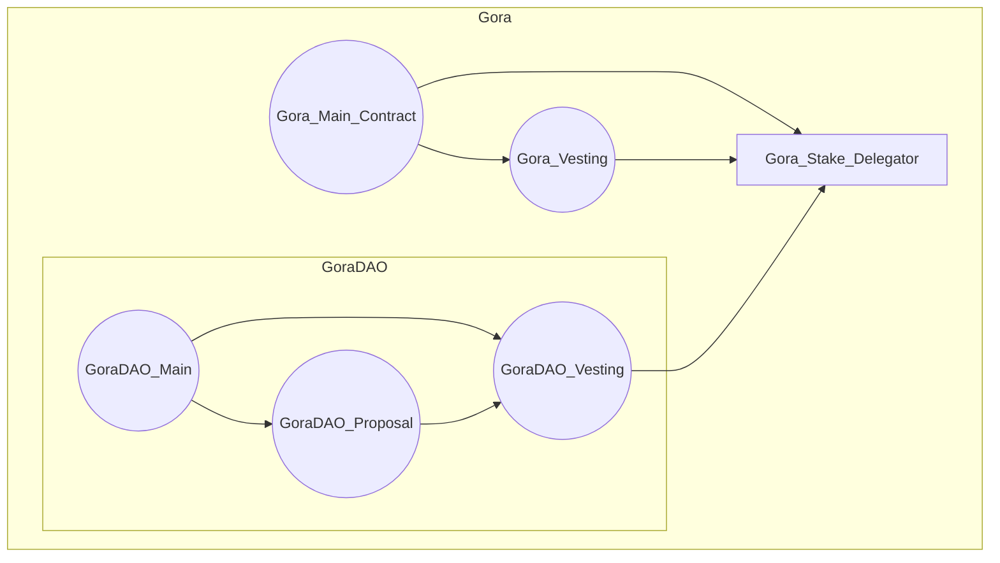
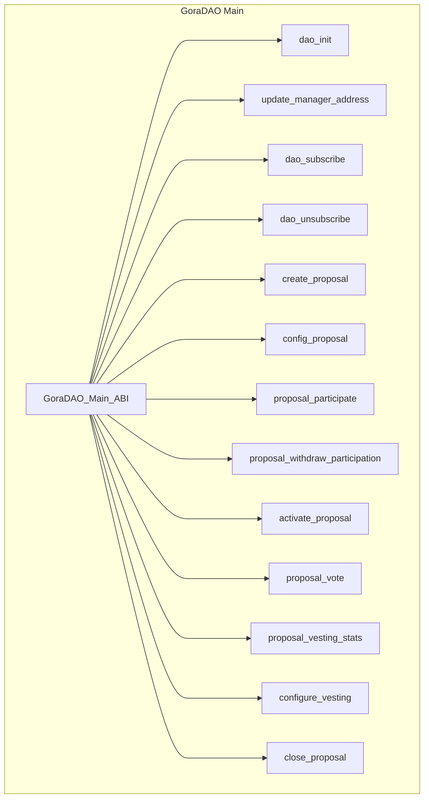
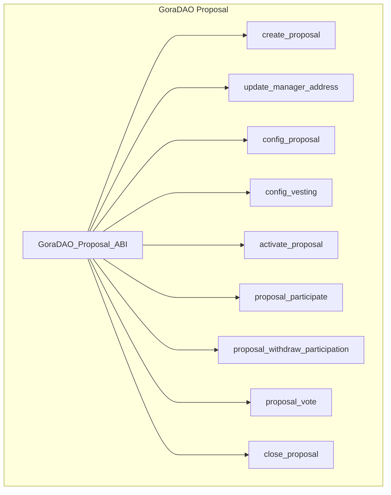

# GoraDAO
### A new non-opinionated, dynamic approach to DAO


    .d8888b.                           8888888b.        d8888  .d88888b.  
    d88P  Y88b                          888  "Y88b      d88888 d88P" "Y88b 
    888    888                          888    888     d88P888 888     888 
    888         .d88b.  888d888 8888b.  888    888    d88P 888 888     888 
    888  88888 d88""88b 888P"      "88b 888    888   d88P  888 888     888 
    888    888 888  888 888    .d888888 888    888  d88P   888 888     888 
    Y88b  d88P Y88..88P 888    888  888 888  .d88P d8888888888 Y88b. .d88P 
     "Y8888P88  "Y88P"  888    "Y888888 8888888P" d88P     888  "Y88888P"  

#### GoraDAO is developed, maintained, and implemented as GoraDAO service by [Gora Network](https://gora.io)!

This repository is a work in progress and contains Algorand TEAL smart contracts of GoraDAO, plus interactive CLI to test and operate it!

GoraDAO provides dynamic generation of Proposals and Vesting (optional for future development phase ) contracts via C2C calls and offers unique DAO features:

- Self-contained, decentralized, and permissionless lifecycle via interactive CLI
- 100% Sybil resistant
- 100% double-vote resistant (as per identity level on Algorand blockchain)
- Configurable Subscription to DAO and Participation to Proposals
- Configurable Voting
- Configurable Algo and BYOT for staking and fees
- full separation of concerns on staking and fees on both proposals and voting aspects to maintain 100% decentralization and permissionless system
- Configurable Vesting (future phase)

A note on DAO business processes:

- GoraDAO Proposal Proposers processes
  - Meet requirements (Minimum subscription fees in Algo and/or DAO Token)
  - Subscribe to DAO
  - Propose proposals
- GoraDAO Proposal Participants processes
  - Meet requirements (Minimum participation stakings and fees in Algo and/or DAO Token)
  - Participate in proposal (it's like registration for voting)
  - Cast vote
- GoraDAO managers processes:
  - Deploy DAO
  - Configure DAO
  - Distribute DAO token

A note on threshold parameters structure:
Each proposal's behavior regarding activation for voting, the conclusion of voting, and such is controlled through some parameters during the proposal configuration ABI call:

- participation threshold: an array (tuple) of Uint64 integer numbers of expected participation count (e.g how many would participate in voting)
- vote threshold: an array (tuple) of Uint64 integer numbers, the same size as the participation threshold ( extra values will be ignored by smart contract), including voting thresholds for peer index of participation threshold (for example: if 250 participants then 150 votes are needed for the proposal to pass). 
- proposal allocations: an array (tuple) of Uint64 integer numbers, the same size as the participation threshold ( extra values will be ignored by smart contract), including allocation amounts for peer index of participation threshold (example: if 250 participants then 150 votes are needed for the proposal to pass and all 1000000 requested token are approved to be allocated for vesting)

Example: `
[250,150, 100]
[150,85, 50]
[1000000,750000, 500000]
`

Important note: On UI level these numbers should be asked from the user as percentages and there (based on the total amount) software should calculate the rounded integer numbers for each index on each parameter and then make the ABI call.

With this innovative approach, DAO proposals get more dynamic and proactive in the face of different participation behaviors from the community!

## Gora DAO Contracts: V1

GoraDAO contracts follow these principal designs:
- No static or hard-coded value
- All scenarios are created based on ABI calls to GoraDAO contracts
- There is one Proposal and one Vesting contract(future work) per Proposal to make the GoraDAO as decentralized and permission-less as possible!
- ABIs 100% compliant with ARC4
- No Update or Delete for Proposals
- No app opt-in or local state usage anywhere

As illustrated in the following diagram GoraDAO on-chain architecture is focused on integration and interoperability with existing working Gora smart contracts!

**Gora & GoraDAO on-chain architecture:**


### Gora DAO Main Contract: V1

GoraDAO main contract, once deployed to a network, will be responsible for generating Proposal units, consisted of a Proposal and a Vesting Contract(future work) dedicated to that proposal case! This design is to take permission-less and decentralization to the max for GoraDAO!
GoraNetwork deploys the GoraDAO main contract and owns managerial rights to it and optionally can assign a manager address to delegate the authority to another Algorand account address!

Proposal contract create and configure ABI calls would create Proposal units (if all criteria is met by the call ARGs) and after that the Proposal creator account would be the manager of that Proposal unit and inherently can assign and delegate this to another account!
The scope of authority Proposal manager account has is not broad and is only to maintain 100% non-custodial, decentralized and permission-less DAO protocol, nothing more! For example, Proposal manager cannot delete proposal and just can deactivate it and withdraw from it! Delete and update are disabled on Proposals as well as their peer vesting contracts (future work)!

The phases of a proposal lifecycle are:

- Creation
- Configuration
- Participation
- Voting activation
- Voting
- Closure
- Force Closure


Important note: Force_Close_Proposal is a multi step process , only designed for extreme emergency cases where something is agreed by almost everyone to go wrong and therefore grants from owner, manager_address and also Gora main contract manager are needed to be effective and close the Proposal and archive it! There are no limitations on creating a new Proposal with identical specifications though!

The activate_proposal is a manual override in case of min_participation is not met! The voting activation handled in GoraDAO:
- Time based activation in case that min-participation is met!
- Min participation is met before start time---> activate_proposal can activate (This does not change the voting ending conditions including end_time and all_voted).

Note : Because the vesting(future work) and staking contracts architecture is still an open topic in GoraNetwork, Configure_Vesting method is not detailed in ABI or TEAL code yet!

IDEA: Add configuration to GoraDAO in a way that it should only come from a child proposal to be approved sothat there can be Proposals in the future to tune GoraDAO further more or change the settings on that! E.g. the required Gora amount to create a Proposal!


### Gora DAO Proposal Contract: V1
GoraDAO Proposal contracts are created from an ABI call to main contract and constitute an inner transaction C2C call to create Proposal contract!

Some methods have constraint of being in same transaction group as a call to identical method name with different signature to either GoraDAO main or vesting contracts! These methods are:

- Configure_Proposal
- Configure_Vesting
- Proposal_Participate
- Activate_Voting
- Proposal_Withdraw_Participation
- Force_Close_Proposal



## GoraDAO Main Contract Methods

- config_dao: Initializes DAO! Should be sent by owner (Creator) of DAO! Returns the manager address!
- subscribe_dao: Subscribes an Algorand account into GoraDAO! Returns total number of members!
- unsubscribe_dao: Unsubscribes an Algorand account from GoraDAO! Returns total number of members!
- write_source_box: Writes the compiled teal source of proposal to a corresponding box - proposal_approval or proposal_clear.
- create_proposal: Creates a new Proposal contract! Returns the Proposal contract ID!
- update_proposal: Updates a Proposal smart contract and returns application ID.
- config_proposal: Configures a Proposal contract! Returns the Proposal contract ID!
- proposal_participate: Participates a member to a Proposal! Returns the Proposal contract ID!
- proposal_withdraw_participate: Withdraws a member participation from a Proposal! Returns the Proposal contract ID!
- proposal_vote: Optionally Votes to a Proposal! Returns the Proposal contract ID!
activate_proposal: Activates a Proposal! Returns the Proposal contract ID!
- close_proposal: Force closes a Proposal contract as last resort. Returns the Proposal contract ID!
``` Mermaid
graph TD
    GoraDAO_Main[GoraDAO Main Contract]
    GoraDAO_Main --> config_dao[config_dao]
    GoraDAO_Main --> subscribe_dao[subscribe_dao]
    GoraDAO_Main --> unsubscribe_dao[unsubscribe_dao]
    GoraDAO_Main --> write_source_box[write_source_box]
    GoraDAO_Main --> create_proposal[create_proposal]
    GoraDAO_Main --> update_proposal[update_proposal]
    GoraDAO_Main --> config_proposal[config_proposal]
    GoraDAO_Main --> proposal_participate[proposal_participate]
    GoraDAO_Main --> proposal_withdraw_participate[proposal_withdraw_participate]
    GoraDAO_Main --> proposal_vote[proposal_vote]
    GoraDAO_Main --> activate_proposal[activate_proposal]
    GoraDAO_Main --> close_proposal[close_proposal]
```
## GoraDAO Proposals Contract Methods
- create_proposal: Creates a new Proposal contract! Returns the Proposal contract ID!
- optin_proposal_asset: Signal to optin to proposal asset.
- update_proposal: Updates an existing Proposal contract! Returns the Proposal contract ID!
- config_proposal: Configures a Proposal contract! Returns the Proposal contract ID!
- update_manager_address: Updates Proposal manager address! Returns new manager address.
- activate_proposal: Activates a Proposal voting! Returns the Proposal contract ID!
- close_proposal: Force closes a Proposal contract as a last resort. Returns the Proposal contract ID!
- proposal_participate: Participates with a member account into a Proposal! Returns the participating member's account address!
- proposal_withdraw_participate: Withdraws participation of a member account from a Proposal! Returns the withdrawing member's account address!
- proposal_vote: Votes for a Proposal! Returns the voting member's account address concatenated with vote!

``` Mermaid
graph TD
    GoraDAO_Proposals[GoraDAO Proposals Contract]
    GoraDAO_Proposals --> create_proposal_P[create_proposal]
    GoraDAO_Proposals --> optin_proposal_asset[optin_proposal_asset]
    GoraDAO_Proposals --> update_proposal_P[update_proposal]
    GoraDAO_Proposals --> config_proposal_P[config_proposal]
    GoraDAO_Proposals --> update_manager_address[update_manager_address]
    GoraDAO_Proposals --> activate_proposal_P[activate_proposal]
    GoraDAO_Proposals --> close_proposal_P[close_proposal]
    GoraDAO_Proposals --> proposal_participate_P[proposal_participate]
    GoraDAO_Proposals --> proposal_withdraw_participate_P[proposal_withdraw_participate]
    GoraDAO_Proposals --> proposal_vote_P[proposal_vote]
```


## GoraDAO interactive CLI Screen cast 


