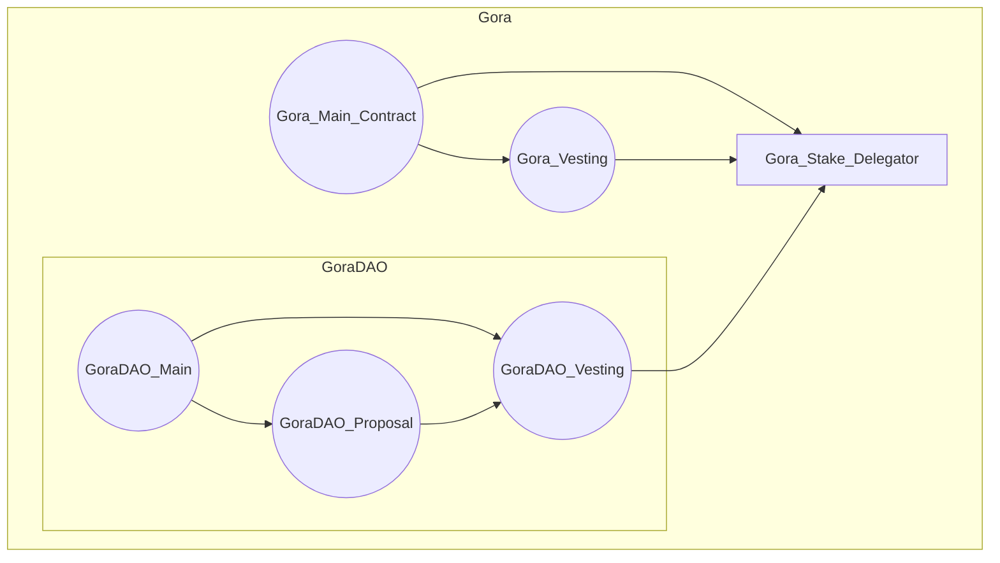
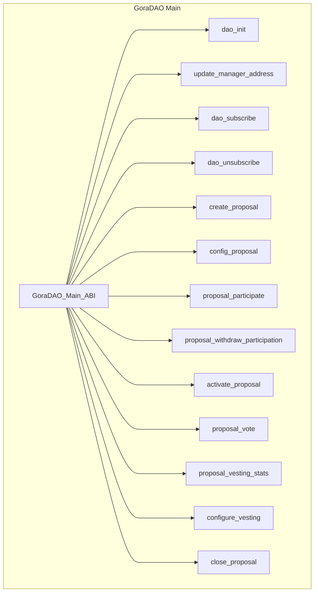
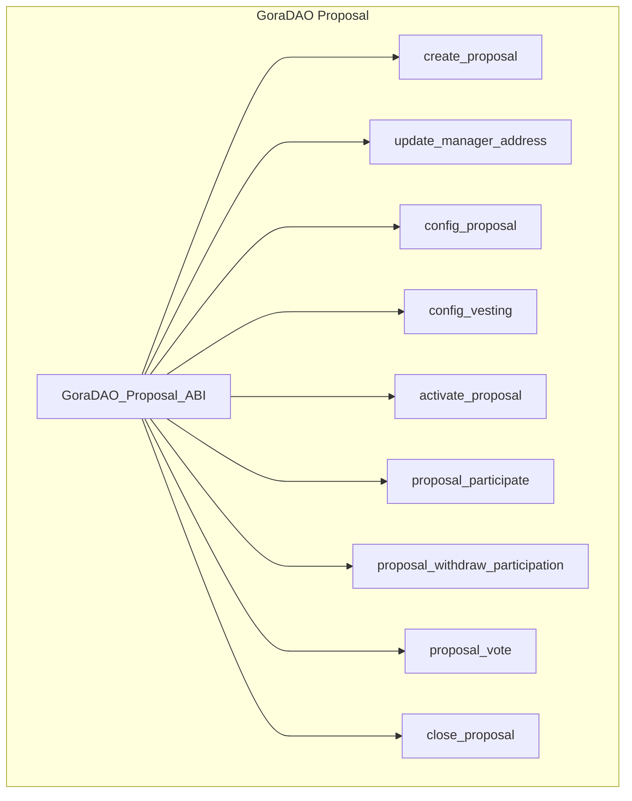
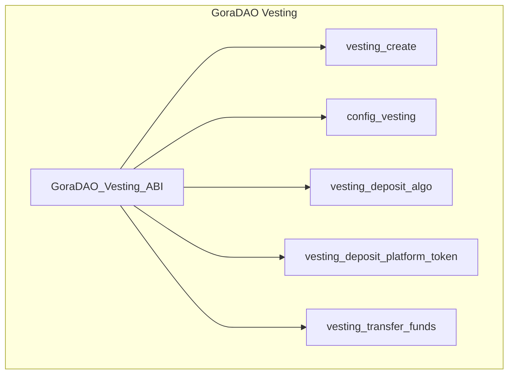

# gora-dao-smartcontracts

#### GoraDAO is Gora Network's DAO system!

(WIP!) This repository contains Algorand AVM smart contracts of GoraDAO!

GoraDAO uses dynamic generation of Proposals and Vesting (optional ) contracts via C2C calls and brings unique features onto the DAO technology:

- Optional Vesting
- Optional Staking
- Configurable Voting
- Configurable Vesting
- Configurable Algo and/or BYOT

A note on thresholds structure:

`[100,100,51]` is a threshold scenario and is consisted of 3 unsigned integers between 0-100! First is threshold of participation , second is the percentage of vesting application and third is the required percentage for approval! Gora proposal accepts array of this array as array of voting scenarios depending of participation percentage!
This lets a proposal to continue operation and go to vote even if the originally anticipated participation has not occured! This can have either the same or different allocations and required approval percentages!

Example: `[[100,100, 52],[80, 70, 70], [60, 50, 70]]`

With this innovative approach DAO proposals get more dynamic and proactive in the face of different participation behaviors from community!

## Gora DAO Contracts: V1

GoraDAO contracts follow these principal designs:
- No static or hard coded value
- All scenarios are created based on ABI calls to GoraDAO contracts
- There are one Proposal and one Vesting contract per Proposal to make the GoraDAO as decentralized and permission-less as possible!
- ABIs complying to ARC4
- No Update or Delete for Proposals
- No app opt-in or local state usage anywhere

As illustrated in following diagram GoraDAO on-chain architecture is focused on integration and interoperability with existing working Gora smart contracts!

**Gora & GoraDAO on-chain architecture:**

### Gora DAO Main Contract: V1

GoraDAO main contract, once deployed to a network, will be responsible for generating Proposal units, consisted of a Proposal and a Vesting Contract dedicated to that proposal case! This design is to take permission-less and decentralization to the max for GoraDAO!
GoraNetwork deploys the GoraDAO main contract and owns managerial rights to it and optionally can assign a manager address to delegate the authority to another Algorand account address!

Proposal contract create and configure ABI calls would create Proposal units (if all criteria is met by the call ARGs) and after that the Proposal creator account would be the manager of that Proposal unit and inherently can assign and delegate this to another account!
The scope of authority Proposal manager account has is not broad and is only to maintain 100% non-custodial, decentralized and permission-less DAO protocol, nothing more! For example, Proposal manager cannot delete proposal and just can deactivate it and withdraw from it! Delete and update are disabled on Proposals as well as their peer vesting contracts!

Some methods are support methods and actual operation happens on the method with same name but different signature on Proposal smart contract! this interaction mostly assures some criteria checks for Proposal interaction and some state updates for GoraDAO! Those methods are:

- Configure_Proposal
- Activate_Voting
- Proposal_Participate
- Proposal_Withdraw_Participation
- Force_Close_Proposal

Force_Close_Proposal is a multi step process , only designed for extreme emergency cases where something is agreed by almost everyone to go wrong and therefore grants from owner, manager_address and also Gora main contract manager are needed to be effective and close the Proposal and archive it! There are no limitations on creating a new Proposal with identical specifications though!

The activate_proposal is a manual override in case of min_participation is not met! The voting activation handled in GoraDAO:
- Time based activation in case that min-participation is met!
- Min participation is met before start time---> activate_proposal can activate (This does not change the voting ending conditions including end_time and all_voted).

Note : Because the vesting and staking contracts architecture is still an open topic in GoraNetwork, Configure_Vesting method is not detailed in ABI or TEAL code yet!

IDEA: Add configuration to GoraDAO in a way that it should only come from a child proposal to be approved sothat there can be Proposals in the future to tune GoraDAO further more or change the settings on that! E.g. the required Gora amount to create a Proposal!

### Gora DAO Proposal Contract: V1
GoraDAO Proposal contracts are created from an ABI call to main contract and constitute an inner transaction C2C call to create Proposal contract!

Some methods have constraint of being in same transaction group as a call to identical method name with different signature to either GoraDAO main or vesting contracts! These methods are:

- Configure_Proposal
- Configure_Vesting
- Proposal_Participate
- Activate_Voting
- Proposal_Withdraw_Participation
- Force_Close_Proposal

### Gora DAO Vesting Contract: V1

GoraDAO Vesting contracts are bound to Proposals and will be activated by the first successful vote approval which passes the active proposal threshold! 

The vesting algorithm is provided by Configure_Vesting method, during which the vesting configuration is sent via args plus necessary related data such as proper Lease values as needed! There are two major vesting algorithm parameters:

- Initial vesting delay (no matter what this much round or time further vesting starts)
- Based on vesting config including how many payments and time window between vestings!
- After voting starts on Proposal contract there is no configurations allowed

TODO: Vesting algorithm ...

QUESTION: Is this a good approach to have vesting contract per approved proposal which intends to maximize decentralization or it is better to make it less decentralized and use Gora Vesting contract and stake delegation ABIs via C2C calls from Proposal contracts? Regardless , the focus is on GoraDAO Proposals contracts lifecycle and Voting operations!

IDEA: A time beacon oracle for apps to subscribe to and receive push chain time scheduled or GoraDAO events based announcements (this can be extended into VRF random beacon and app ABI call beacon oracles as to be added to GoraNetworks oracle catalogues)!

IDEA: the above idea can be generalized with an ARC for a general oracle beacon service from GoraNetwork! This does not need any consensus or voting and just using a predictable lease with all beacon sources!
  

