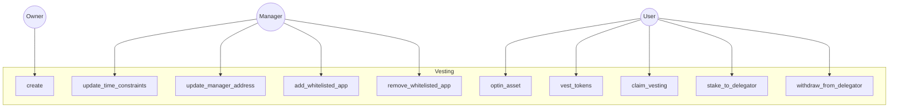
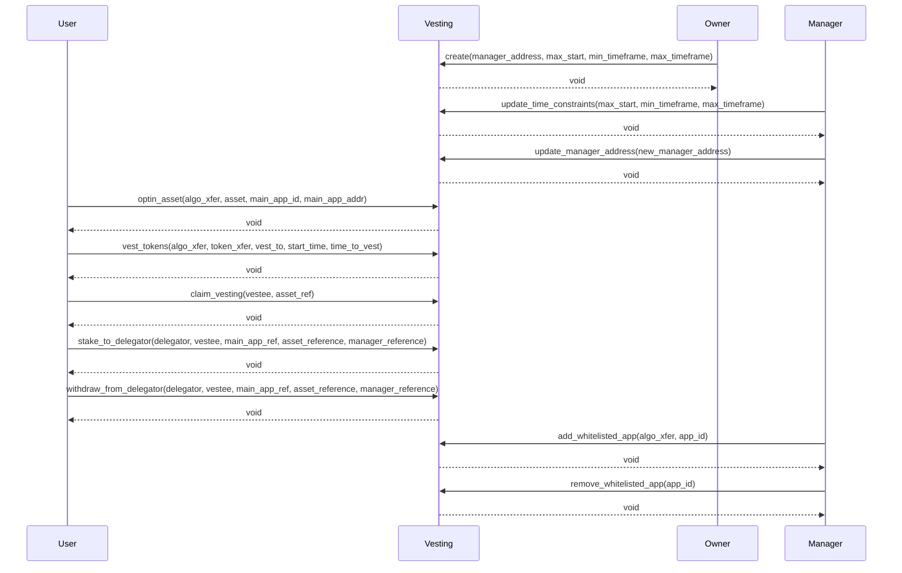
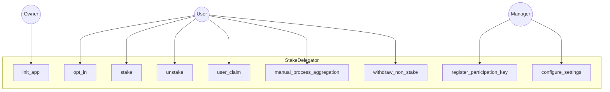
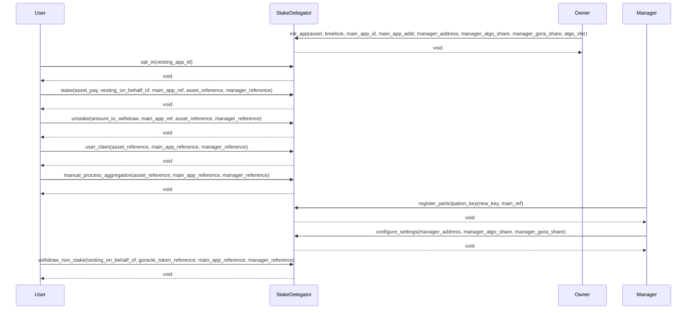
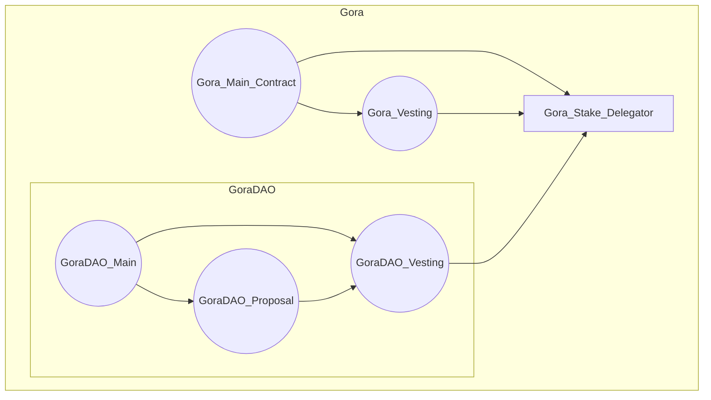
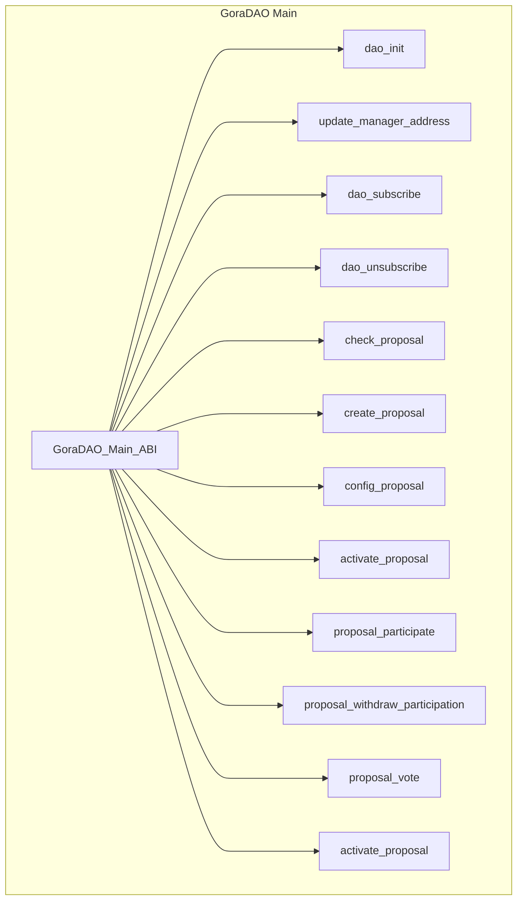

# gora-dao-smartcontracts

#### GoraDAO is Gora Network's DAO system!

(WIP!) This repository contains Algorand AVM smart contracts of GoraDAO!

GoraDAO re-uses the existing Gora contracts as much as possible for sake of interoperability and better integration but for that purpose the TEAL source code (compiled from higher level languages) must be optimized and undergo some slight changes to be completely deployable within GoraDAO process, operations and logic!

## Gora Existing Contracts: V2

### Gora Vesting Contracts: V2
The Vesting contract in GoraNetwork is designed to manage the vesting schedules of tokens for users. It allows the creation of vesting parameters, including setting up a manager's address and defining time constraints for vesting. Users can opt into assets, vest tokens according to a specified schedule, and claim vested tokens when the time is right. The contract also integrates with the StakeDelegator, enabling users to stake their vested tokens to the delegator or withdraw them. Managers have the authority to update time constraints, change the manager's address, and manage a whitelist of apps that can interact with the vesting system. This contract ensures that tokens are vested and claimed in a secure and time-bound manner, reinforcing trust and transparency in the GoraNetwork's token distribution process.

These passages provide a high-level overview of the roles of the StakeDelegator and Vesting contracts in the GoraNetwork system. The exact functionalities and intricacies would be better understood by diving deeper into the contract code and the broader GoraNetwork architecture.

### Gora Stake delegation Contracts: V2

The StakeDelegator contract serves as a central hub for staking operations in the GoraNetwork. It facilitates the initialization of a stake delegation manager app on-chain with parameters like the Gora main app's ID, address, and stake delegation manager's address. Users can opt into the system, stake their assets, and unstake them when needed. The contract also provides functionalities for users to claim their stakes, manually process aggregations, and register participation keys. Managers have the flexibility to configure settings, such as updating their address and defining their share percentages. Additionally, the contract ensures secure transfers of Algos and assets, making it a pivotal component in the staking ecosystem of GoraNetwork.

## Gora DAO Contracts: V1

GoraDAO contracts follow these principal designs:
- No static or hard coded value
- All scenarios are created based on C2C calls to GoraDAO main contract
- There are one Proposal and one Vesting contract per Proposal to make the GoraDAO as decentralized and permission-less as possible!
- ABIs complying to ARC4
- No app optin or local state usage anywhere

As illustrated in following diagram GoraDAO on-chain architecture is focused on integration and interoperability with existing working Gora smart contracts!

**Gora & GoraDAO on-chain architecture:**

### Gora DAO Main Contract: V1

GoraDAO main contract, once deployed to a network, will be responsible for generating Proposal units, consisted of a Proposal and a Vesting Contract dedicated to that proposal case! This design is to take permission-less and decentralization to the max for GoraDAO!
GoraNetwork deploys the GoraDAO main contract and owns managerial rights to it and optionally can assign a manager address to delegate the authority to another Algorand account address!

Proposal contract create and configure ABI calls would create Proposal units (if all criteria is met by the call ARGs) and after that the Proposal creator account would be the manager of that Proposal unit and inherently can assign and delegate this to another account!
The scope of authority Proposal manager account has is not broad and is only to maintain 100% non-custodial, decentralized and permission-less DAO protocol, nothing more! For example, Proposal manager cannot delete proposal and just can deactivate it and withdraw from it! Delete and update are disabled on Proposals as well as their peer vesting contracts!

Some methods are support methods and actual operation happens on the method with same name but different signature on Proposal smart contract! this interaction mostly assures some criteria checks for Proposal interaction and some state updates for GoraDAO! Those methods are:

- Configure_Proposal
- Activate_Voting
- Proposal_Participate
- Proposal_Withdraw_Participation
- Force_Close_Proposal

### Gora DAO Proposal Contract: V1
### Gora DAO Vesting Contract: V1
